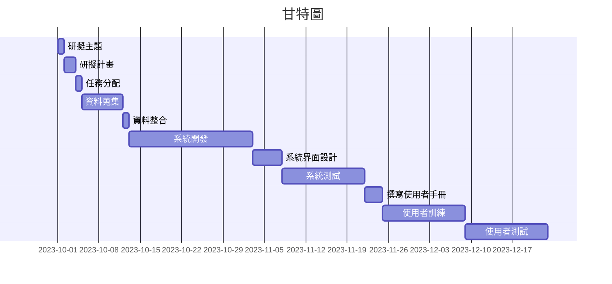
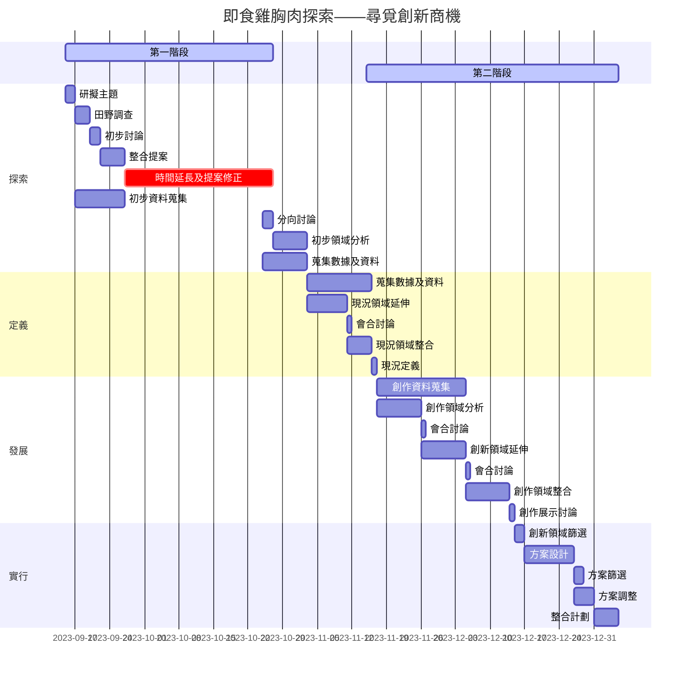

## 112-1 系統分析與設計
### 甲班第十五組 ＋ 乙班第一組
### 專題名稱： **智慧零售系統**
### 專題簡介：
在現今科技當道的世代，隨著電商、行動購物、D2C（Direct to Customer）等銷售模式崛起，讓消費者期待在線上、線下都能獲得更好的服務，這樣令到許多傳統零售品牌的地位受到挑戰。加上 2020 年疫情爆發，台灣實體零售的整體業績僅成長0.2%，電商銷售卻逆勢成長16.1%，讓品牌不得不轉型智慧零售，加強服務全通路消費者。另外，A公司是在即食肉品零售市場發展已成熟時才進入市場的競爭者，通路銷售平台及產品數量卻都不及目前市場上的主要競爭者，難以在市場上立足。而且A公司現時使用較低成本的手動記帳及貨物盤點已經過時，過慢的流程也不合乎成本效益。為了方便A公司能靈活善用科技帶來的好處及提升該公司的品牌知名度，我們這次為A公司制定行銷策略，導入智慧銷售系統提升銷售競爭力。

---
### 本組組員名單：
|班別|學號|姓名|帳戶名稱|
|:-----:|:-----:|:-----:|:-----:|
|三甲|C110134148|**梁詩敏**（甲班組長）|C110134148|
|三乙|C110118260|李俊賢（乙班）|C110118260|      
|四丙|B111118301|**司徒嘉略**（乙班組長）|Ssutu|

---

 # 
 
|      任務   |     說明      |  需時(天) | 前置任務|人員|
|:-------------:|:-------------| :-----:|:-----:|:-----:|
| 1 |尋找動機 | 1 | - |李俊賢 |
| 2 |研擬計畫 | 2 | 1 |司徒嘉略 |
| 3 |任務分配 | 1 | 2 |梁詩敏 |
| 4 |資料蒐集 | 7 |  3 |全員 |
| 5 |資料整合 | 1 |  4 |梁詩敏 |
| 6 |系統開發 | 21  | 5 | 梁詩敏、李俊賢 |
| 7 |系統界面設計 | 5  | 6 | 司徒嘉略 |
| 8 |系統測試和修改 | 14 |  7 |全員 |
| 9 |撰寫使用者手冊 | 3 |  8 |李俊賢、司徒嘉略 |
| 10 |使用者訓練 | 14 |  9 |全員 |
| 11 |最終使用者測試 | 14|  10  |全員 |

## 甘特圖

## PERT圖

## 關鍵路徑
關鍵路徑： 1 → 2 → 3 → 4 → 5 → 6 → 10 → 11

